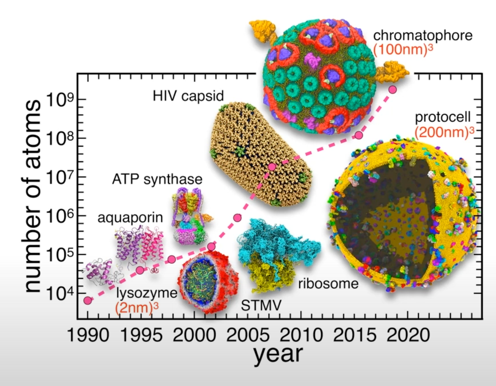
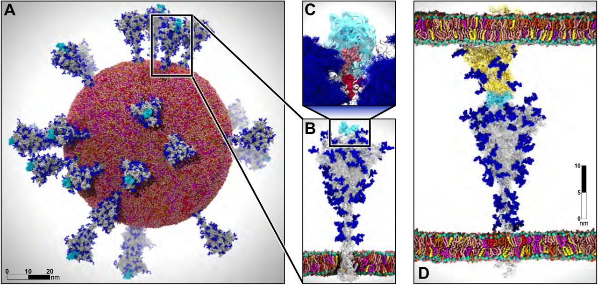
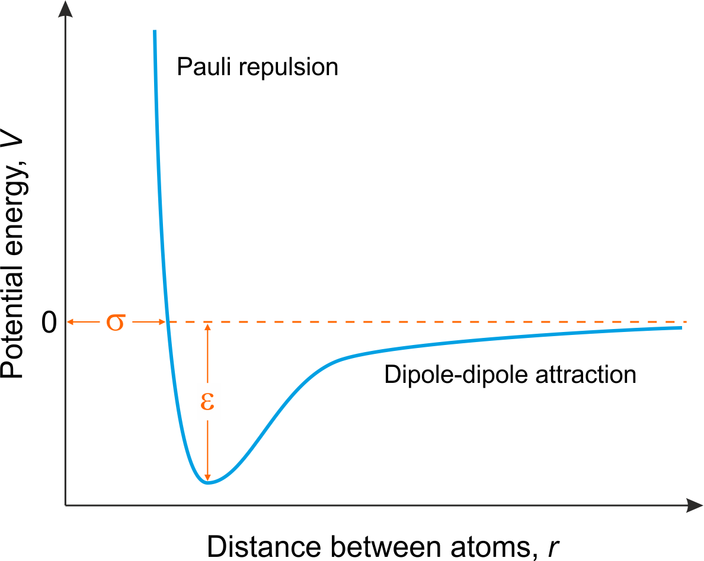
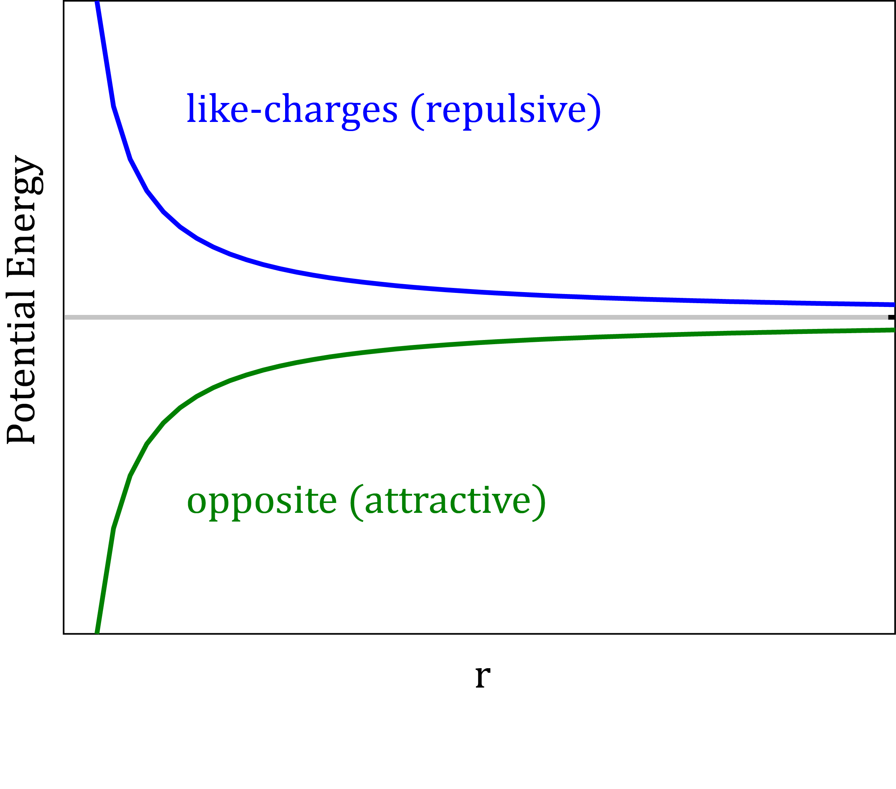
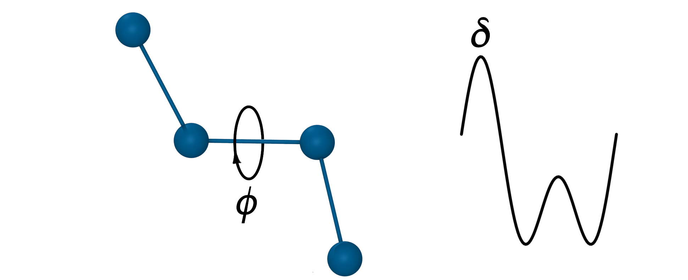
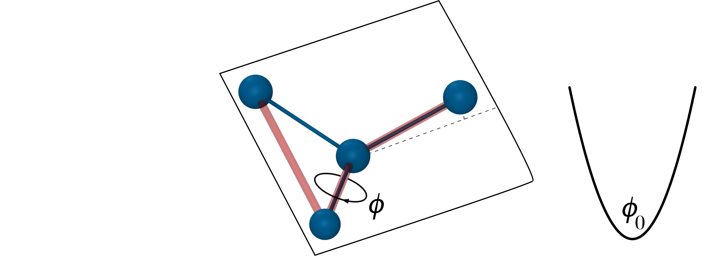

## Introduction
Atoms and molecules, the building blocks of matter, interact with each other. They are attracted at long distances, but at short distances the interactions become strongly repulsive. In fact, there is no need to look for a proof of such interactions. We can observe results of these interactions indirectly with our own eyes every day. For example, due to the attractive forces water molecules stick together to form drops, which in turn rain down to fill rivers. Thanks to the strong repulsion, on the other hand, one liter of that very same water weighs always about 1 kg, regardless of how much pressure we use in trying to compress it.

Today, we carry out molecular modeling by following and analyzing dynamic structural models in computers. Historically, the modeling of molecules started long before the invention of computers. In the mid-1800's structural models were suggested for molecules to explain their chemical and physical properties. The first attempts to model interacting molecules go back to van der Waals' pioneering work, ["About the continuity of the gas and liquid state"](https://www.worldcat.org/title/over-de-continuiteit-van-den-gas-en-vloeistoftoestand/oclc/3301223) published in 1873. Using a simple state equation where the molecules were approximated as spheres attracting each other, he could predict gas-liquid phase transition. We still use many of the conceptual ideas from over a century ago in modern molecular modeling and simulations. The size and the length of MD simulations has been recently vastly improved. Longer and larger simulations allow us to tackle wider range of problems under a wide variety of conditions. 

{: width="400" }

Figure from: [AI-Driven Multiscale Simulations Illuminate Mechanisms of SARS-CoV-2 Spike Dynamics](https://youtu.be/EIReA3s1Nwk)

One of the recent examples is simulation of the whole SARS-CoV-2 virion. The goal of this work was to understand how this virus infects cells. The MD simulations revealed conformational transitions of the spike protein, and its interactions with ACE2 receptors. The simulation showed how the receptor binding domain of the spike protein hidden from antibodies by polysacharides spontaneously undergoes conformational transition that pushes it out of the glycan shield and thus enables interaction with ACE2 (angiotensin-converting enzyme) "receptors" of the host cells. The virion model included 305 million atoms, it had a lipid envelope of 75 nm in diameter with a full virion diameter of 120 nm. The multiscale simulations were performed using a combination of NAMD, VMD, AMBER, the Weighted Ensemble Simulation Toolkit and AI. The whole system was simulated on the Summit supercomputer at Oak Ridge National Laboratory for a total time of 84 ns using NAMD. In addition a weighted ensemble of a smaller spike protein systems was simulated using GPU accelerated AMBER software. 

{: width="480" }

Figure from [AI-Driven Multiscale Simulations Illuminate Mechanisms of SARS-CoV-2 Spike Dynamics](https://www.biorxiv.org/content/10.1101/2020.11.19.390187v1)

The goal of this workshop is to introduce you to the method of molecular dynamics simulations and guide you to using various molecular dynamics simulation packages and utilities including NAMD, VMD, and AMBER. We will show how to use Compute Canada clusters for all steps of system preparation, MD and data analysis. The focus will be on reproducibility and automation by introducing scripting and batch mode.

In this first session will introduce the theory behind the method of MD. The objectives of this lesson is to give you a broad picture of the current methods of modeling the interactions between particles and simulating dynamics.

## Force Fields
Development of the method of molecular dynamics was largely driven by the desire to understand complex biological phenomena on the molecular level. To get insights into such processes simulations of large systems for a long time windows were required.

While the physical background of intermolecular interactions is known, there is a very complex mixture of quantum mechanical forces acting at a close distance. The forces between atoms and molecules arise from dynamic interactions between numerous electrons orbiting atoms. The interactions between electron clouds are so complex that they cannot be described analytically, and they can not be computed numerically fast enough for a dynamic simulation on a relevant scale. 

To make molecular dynamics simulations possible a way to evaluate molecular interactions very fast was needed. To achieve this goal molecular interactions in molecular dynamics are approximated with a simple empirical potential energy function.

The potential energy function *U* is a cornerstone of the MD simulations because it allows calculating forces. The force on an object is the negative of the derivative of the potential energy function:

$\vec{F}=-\nabla{U}(\vec{r})$

Once we know forces acting on an object we can calculate how its position changes in time. To propagate a simulation in time molecular dynamics applies classical Newton's equation of motion stating that the rate of change of momentum $$ \vec{p} $$ of an object equals the force $$ \vec{F} $$ acting on it:

$ \vec{F}=\frac{d\vec{p}}{dt} $

To summarize, if we know how to calculate the potential energy of a system then we can calculate forces and propagate a system in time. In other words, to run a molecular dynamics simulation we need to know the interaction potential for the particles in the system, from which we can calculate the forces acting on atoms and advance a system in time.

{: width="480" }

Molecular dynamics programs use force fields to run simulations. A force field (FF) is a set of empirical energy functions and parameters allowing to calculate the potential energy *U* of a system of atoms and/or molecules as a function of the molecular coordinates. Classical molecular mechanics potential energy function used in MD simulations is an empirical function composed of non-bonded and bonded interactions:

$U(\vec{r})=\sum{U_{bonded}}(\vec{r})+\sum{U_{non-bonded}}(\vec{r})$

Typically MD simulations are limited to evaluating only interactions between pairs of atoms. In this approximation force fields are based on two-body potentials, and the energy of the whole system is described by the 2-dimensional force matrix of the pairwise interactions.

For convenience force fields can be divided into 3 general classes based on how complex they are.
### Class 1 force fields.
In the class 1 force field dynamics of bond stretching and angle bending are described by simple harmonic motion, i.e. the magnitude of restoring force is assumed to be proportional to the displacement from the equilibrium position. As the energy of a harmonic oscillator is proportional to the square of the displacement, this approximation is called quadratic. In general, bond stretching and angle bending are close to harmonic only near the equilibrium. Higher-order anharmonic energy terms are required for a more accurate description of molecular motions. In the class 1 force field force matrix is diagonal because correlations between bond stretching and angle bending are omitted.
### Class 2 force fields.
Class 2 force fields add anharmonic cubic and/or quartic terms to the potential energy for bonds and angles. Besides, they contain cross-terms describing the coupling between adjacent bonds, angles and dihedrals. Higher-order terms and cross terms allow for a better description of interactions resulting in a more accurate reproduction of bond and angle vibrations. However much more target data is needed for the determination of these additional parameters.
[MMFF94](https://doi.org/10.1002/(SICI)1096-987X(199905)20:7<730::AID-JCC8>3.0.CO;2-T), [UFF](https://pubs.acs.org/doi/10.1021/ja00051a040)
### Class 3 force fields.
Class 3 force fields explicitly add special effects of organic chemistry. For example polarization,stereoelectronic effects, electronegativity effect, Jahn–Teller effect, etc. Examples of class 3 force fields are: [AMOEBA](https://pubmed.ncbi.nlm.nih.gov/24163642/), [DRUDE](https://pubs.acs.org/doi/10.1021/acs.jctc.7b00262)

## Energy Terms of Biomolecular Force Fields
Most force fields for biomolecular simulations are minimalistic class 1 force fields trading off rigor of the physical representation for the ability to simulate large systems for a long period of time. As we have already learned, potential energy function is composed of non-bonded and bonded interactions. Let's have a closer look at these energy terms.

### Non-Bonded Terms
The non-bonded potential terms describe non-elecrostatic and electrostatic interactions between all pairs of atoms. Non-elecrostatic potential energy is most commonly described with the Lennard-Jones potential.
#### The Lennard-Jones potential
The Lennard-Jones (LJ) potential approximates the potential energy of non-elecrostatic interaction between a pair of non-bonded atoms or molecules with a simple mathematical function:

$V_{LJ}(r)=\frac{C12}{r^{12}}-\frac{C6}{r^{6}}$

The $$r^{-12}$$ term approximates the strong Pauli repulsion originating from overlap of electron orbitals, while the $$r^{-6}$$ term describes weaker attractive forces acting between local dynamically induced dipoles in the valence orbitals. While the attractive term is physically realistic (London dispersive forces have $$r^{-6}$$ distance dependence), the repulsive term is a crude approximation of exponentially decaying repulsive interaction. The too steep repulsive part often leads to an overestimation of the pressure in the system.

{: width="360" }

The LJ potential is commonly expressed in terms of the well depth $$\epsilon$$ (the measure of the strength of the interaction) and the van der Waals radius $$\sigma$$ (the distance at which the intermolecular potential between the two particles is zero).

$V_{LJ}(r)=4\epsilon\left[\left(\frac{\sigma}{r}\right)^{12}-\left(\frac{\sigma}{r}\right)^{6}\right]$

The LJ coefficients *C* are related to the $$\sigma$$ and the $$\epsilon$$  with the equations:

 $C12=4\epsilon\sigma^{12},C6=4\epsilon\sigma^{6}$

#### The Lennard-Jones Combining Rules
To describe all *LJ* interactions in a simulations system the matrix of the pairwise interactions is constructed. The *LJ* interactions between different types of atoms are computed by combining the *LJ* parameters. Different force fields use different combining rules.

**Geometric mean:**

$$C12_{ij}=\sqrt{C12_{ii}\times{C12_{jj}}},C6_{ij}=\sqrt{C6_{ii}\times{C6_{jj}}}$$  (GROMOS)

$$\sigma_{ij}=\sqrt{\sigma_{ii}\times\sigma_{jj}},\epsilon_{ij}=\sqrt{\epsilon_{ii}\times\epsilon_{jj}}$$ (OPLS)

**Lorentz–Berthelot:**

$$\sigma_{ij}=\frac{\sigma_{ii}+\sigma_{jj}}{2},\epsilon_{ij}=\sqrt{\epsilon_{ii}\times\epsilon_{jj}}$$ (CHARM, AMBER). This combining rule is  a combination of the arithmetic mean for $$\sigma$$ and the geometric mean for $$\epsilon$$. It is known to overestimate the well depth

**Waldman–Hagler:**

$$\sigma_{ij}=\left(\frac{\sigma_{ii}^{6}+\sigma_{jj}^{6}}{2}\right)^{\frac{1}{6}}$$ , $$ \epsilon_{ij}=\sqrt{\epsilon_{ij}\epsilon_{jj}}\times\frac{2\sigma_{ii}^3\sigma_{jj}^3}{\sigma_{ii}^6+\sigma_{jj}^6}$$

This combining rule was developed specifically for simulation of noble gases.

**Hybrid** (the Lorentz–Berthelot for H and the Waldman–Hagler for other elements). Implemented in the [AMBER-ii](https://pubs.acs.org/doi/abs/10.1021/acs.jpcb.5b07233) force field for perfluoroalkanes, noble gases, and their mixtures with alkanes.

#### The Buckingham potential
The Buckingham potential replaces the repulsive $$r^{-12}$$ term in Lennard-Jones potential by exponential function of distance:

$V_{B}(r)=Aexp(-Br) -\frac{C}{r^{6}}$

Exponential function describes electron density more realistically but it is computationally more expensive to calculate. While using Buckingham potential there is a risk of "Buckingham Catastrophe", the condition when at short-range electrostatic attraction artificially overcomes the repulsive barrier and collision between atoms occurs. This can be remedied by the addition of $$r^{-12}$$ term.

There is only one combining rule for Buckingham potential in GROMACS:

$A_{ij}=\sqrt{(A_{ii}A_{jj})}$

$B_{ij}=2/(\frac{1}{B_{ii}}+\frac{1}{B_{jj}})$

$C_{ij}=\sqrt{(C_{ii}C_{jj})}$

> ## Specifying Combining Rules
> **GROMACS**
>
> Combining rule is specified in the **[defaults]** section of the **forcefield.itp** file (in the column 'comb-rule').
> ~~~
>[ defaults ]
>; nbfunc        comb-rule       gen-pairs       fudgeLJ fudgeQQ
>1               2               yes             0.5     0.8333
> ~~~
> {: .file-content}
> Geometric mean is selected by using rules 1 and 3;
>  Lorentz–Berthelot rule is selected using rule 2.
>
> GROMOS force field requires rule 1; OPLS requires rule 3; CHARM and AMBER require rule 2
>
> The type of potential function is specified in the 'nbfunc' column: 1 selects Lennard-Jones potential, 2 selects Buckingham potential.
{: .callout}
>
> **NAMD**
>
>By default, Lorentz–Berthelot rules are used. Geometric mean can be turned on in the run parameter file:
>~~~
>vdwGeometricSigma yes
>~~~
> {: .file-content}
{: .callout}

#### The electrostatic potential
To describe the elecrostatic interactions in MD the point charges are assigned to the positions of atomic nuclei. The atomic charges are derived using QM methods with the goal to approximate the electrostatic potential around a molecule. The electrostatic potential is described with the Coulomb's law:

$V_{Elec}=\frac{q_{i}q_{j}}{4\pi\epsilon_{0}\epsilon_{r}r_{ij}}$

where *rij* is the distance between the pair of atoms, *qi* and *qj* are the charges on the atoms *i* and *j*,$$\epsilon_{0}$$ is the permittivity of vacuum. and $$\epsilon_{r}$$ is the relative permittivity.

{: width="360" }

> ## Short-range and Long-range Interactions
> The interaction is termed short-range if the potential decreases faster than *r-d*, where *r* is the distance between 2 particles and *d* is dimensionality. Otherwise the interaction is long-ranged. Accordingly the Lennard-Jones interactions are short-ranged, the Coulomb interactions are long-ranged.
{: .callout}

### Bonded Terms

#### The bond potential
The bond potential is used to model the interaction of covalently bonded atoms in a molecule. Bond stretch is approximated by a simple harmonic function describing oscillation about an equilibrium bond length *r0* with bond constant *kb*:

$V_{Bond}=k_b(r_{ij}-r_0)^2$

This is a fairly poor approximation at extreme stretching, but bonds are so stiff that it works for well moderate temperatures. A Morse potential is more accurate, but more expensive to calculate.

#### The angle potential
The angle potential describes the bond bending energy. It is defined for every triplet of bonded atoms. It is also approximated by a harmonic function describing oscillation about an equilibrium angle  $$\theta_{0}$$  with force constant $$k_\theta$$ :

$V_{Angle}=k_\theta(\theta_{ijk}-\theta_0)^2$

The force constants for angle potential are about 5 times smaller that for bond stretching.

#### The torsion (dihedral) angle potential
The torsion energy is defined for every 4 sequentially bonded atoms. The torsion angle $$\phi$$ is the angle of rotation about the covalent bond between the middle two atoms and the potential is given by:

$V_{Dihed}=k_\phi(1+cos(n\phi-\delta)) + ...$

Where the non-negative integer constant *n* defines periodicity and  $$\delta$$ is the phase shift angle.

#### The improper torsion potential
The improper torsion potentials defined for a group of 4 bonded atoms where the central atom i is connected to the 3 peripheral atoms j,k, and l. Such group can be seen as a pyramid and the improper torsion potential is related to the distance of the central atom from the base of the pyramid. This potential is used mainly to keep molecular structures planar. As there is only one energy minimum the improper torsion term can be given by a harmonic function:

$V_{Improper}=k_\phi(\phi-\phi_0)^2$

Where the dihedral angle $$\phi$$ is the angle between planes ijk and jkl.

### Coupling Terms
#### The Urey-Bradley potential
It is known that as a bond angle is decreased, the adjacent bonds stretch to reduce the interaction between the outer atoms of the bonded triplet. This means that there is a coupling between bond length and bond angle. This coupling can be described by the Urey-Bradley potential. The Urey-Bradley term is defined as a (non-covalent) spring between the outer *i* and *k* atoms of a bonded triplet *ijk*. It is approximated by a harmonic function describing oscillation about an equilibrium distance *rub* with force constant *kub*:

$V_{UB}=k_{ub}(r_{ik}-r_{ub})^2$

U-B terms are used to improve agreement with vibrational spectra when a harmonic bending term alone would not adequately fit. These phenomena are largely inconsequential for the overall conformational sampling in a typical biomolecular/organic simulation. The Urey-Bradley term is implemented in the CHARMM force fields.

### CHARMM CMAP potential
CMAP is a grid based error correction map used in CHARMM force field to  correct for errors in non-bonded interactions, electrostatics, lack of coupling terms, inaccurate combination rules and other force field deficiencies. The grid of energy correction factors is constructed using QM data for every combination of $$\phi/\psi$$ dihedral angles of the peptide backbone and further optimized using empirical data. CMAP potential was initially applied to improve CHARMM22 force field. CMAP corrections were later implemented in AMBER force fields [ff99IDPs](https://pubs.acs.org/doi/abs/10.1021/acs.jcim.5b00043) (force field for intrinsically disordered proteins), [ff12SB-cMAP](https://pubs.acs.org/doi/10.1021/acs.jctc.5b00662) (force field for implicit-solvent simulations), and ff19SB. 

### Energy scale of potential terms

|----------------------|:------------------|:
| $$k_BT$$ at 298 K    | ~ 0.593          |$$\frac{kcal}{mol}$$ 
| Bond vibrations      | ~ 100 ‐ 500      |$$\frac{kcal}{mol \cdot \unicode{x212B}^2}$$
| Bond angle bending   | ~ 10 - 50        |$$\frac{kcal}{mol \cdot deg^2}$$
| Dihedral rotations   | ~ 0 - 2.5        |$$\frac{kcal}{mol \cdot deg^2}$$
| van der Waals        | ~ 0.5            |$$\frac{kcal}{mol}$$ 
| Hydrogen bonds       | ~ 0.5 - 1.0      |$$\frac{kcal}{mol}$$ 
| Salt bridges         | ~ 1.2 - 2.5      |$$\frac{kcal}{mol}$$ 

### Exclusions from Non-Bonded Interactions
Pairs of atoms connected by chemical bonds are normally excluded from computation of non-bonded interactions because bonded energy terms replace non-bonded interactions. In biomolecular force fields all pairs of connected atoms separated by up to 2 bonds (1-2 and 1-3 pairs) are excluded from non-bonded interactions. Computation of the non-bonded interaction between 1-4 pairs depends on the specific force field. Some force fields exclude VDW interactions and scale down electrostatic (AMBER) while others may modify both or use electrostatic as is.

Now, there is one specific term in most force fields that should be given some more attention as it turns out to be an intermediate case: a pair of atoms in the outermost positions of a dihedral angle consisting of four atoms and three bonds. In many cases a compromise is made to treat this particular pair partially as a bonded and partially as a non-bonded interaction, and be called the “1–4” interaction. The reason is that steric interactions affect rotations around a bond. However, they are rather rough and in most cases lack further details of local internal conformational degrees of freedom. However, due to the short distance between the 1–4 atoms, both the Lennard–Jones and the Coulombic interactions are normally scaled down substantially. The 1–2 or 1–3 non-bonded interactions are, although somewhat arbitrarily, omitted completely. It is assumed that they are properly described with bond and angle potentials, most often within the harmonic approximation.

> ## Specifying Exclusions
> **GROMACS**
>
> The exclusions are generated by **grompp** as specified in the **[moleculetype]** section of the molecular topology **.top** file:
> ~~~
>[ moleculetype ]
>; name  nrexcl
>Urea         3
> ...
>[ exclusions ]
>;  ai    aj
>    1     2
>    1     3
>    1     4
> ~~~
>{: .file-content}
> In the example above non-bonded interactions between atoms that are no farther than 3 bonds are excluded (nrexcl=3). Extra exclusions may be added explicitly in the **[exclusions]** section.
>
> The scaling factors for 1-4 pairs, **fudgeLJ** and **fudgeQQ**, are specified in the **[defaults]** section of the **forcefield.itp** file. While **fudgeLJ** is used only when **gen-pairs** is set to 'yes', **fudgeQQ** is always used.
>
> ~~~
>[ defaults ]
>; nbfunc        comb-rule       gen-pairs       fudgeLJ fudgeQQ
>1               2               yes             0.5     0.8333
> ~~~
> {: .source}
{: .file-content}
> **NAMD**
>
> Which pairs of bonded atoms should be excluded is specified by the **exclude** parameter.  Acceptable values: **none, 1-2, 1-3, 1-4,** or **scaled1-4**
> ~~~
>exclude scaled1-4
>1-4scaling 0.83
>scnb 2.0
> ~~~
> {: .source}
> If **scaled1-4** is set, the electrostatic interactions for 1-4 pairs are multiplied by a constant factor specified by the **1-4scaling** parameter. The LJ interactions for 1-4 pairs are divided by **scnb**.
{: .callout}

> ## Counting Non-Bonded Interactions
>
> How many non-bonded interactions are in the system with ten Argon atoms?
>
> > ## Solution
> >
> > Argon atoms are neutral, so there is no Coulomb interaction. Atoms don't interact with themselves and the interaction ij is the same as the interaction ji.  Thus the total number of pairwise non-bonded interactions is (10x10 - 10)/2 = 45.
> >
> {: .solution}
{: .challenge}

### What Information Can MD Simulations Provide?

With the help of MD it is possible to model phenomena that cannot be studied experimentally. For example 
- Understand atomistic details of conformational changes, protein unfolding, interactions between proteins and drugs
- Study thermodynamics properties (free energies, binding energies)
- Study biological processes such as (enzyme catalysis, protein complex assembly, protein or RNA folding, etc).

For more examples of the types of information MD simulations can provide read the review article: [Molecular Dynamics Simulation for All](https://www.cell.com/neuron/fulltext/S0896-6273(18)30684-6?_returnURL=https%3A%2F%2Flinkinghub.elsevier.com%2Fretrieve%2Fpii%2FS0896627318306846%3Fshowall%3Dtrue).
