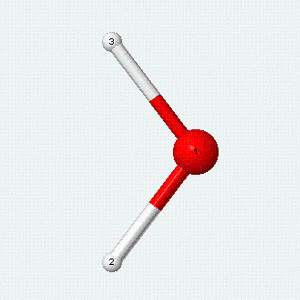
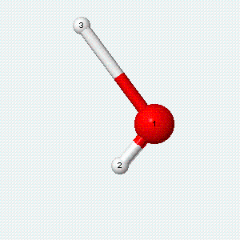

<<<<<<< HEAD
Molecular degrees of freedom refer to the number of uniques ways a molecule may move (increase its kinetic energy. Thus the molecular degrees of freedom describe how kinetic energy is contained and distributed in a molecule. Dynamical molecular systems are characterized by numerous degrees of freedom. The motion of molecules can be decomposed into translational, rotational, and vibrational components. On average, when thermal energy is added to a system, the energy is shared equally among the degrees of freedom (equipartition theorem). In other words, classical equipartition principle states that every (quadratic) degree of freedom contributes equally to the total energy in thermal equilibrium.  Each degree of freedom has an average energy of $$\frac{1}{2}k_BT$$ and contributes $$\frac{1}{2}k_B$$ to the system's heat capacity.
=======
Molecular degrees of freedom refer to the number of unique ways a molecule may move (increase its kinetic energy). Thus the molecular degrees of freedom describe how kinetic energy is contained and distributed in a molecule. Dynamical molecular systems are characterized by numerous degrees of freedom. The motion of molecules can be decomposed into translational, rotational, and vibrational components. On average, when thermal energy is added to a system, the energy is shared equally among the degrees of freedom (equipartition theorem). In other words, classical equipartition principle states that every (quadratic) degree of freedom contributes equally to the total energy in thermal equilibrium.  Each degree of freedom has an average energy of $$\frac{1}{2}k_BT$$ and contributes $$\frac{1}{2}k_B$$ to the system's heat capacity.
>>>>>>> 016c790d4a3e0c8d01bf9c334506f919828e612b

When the same amount of kinetic energy flows into simulation systems containing different types of molecules, their temperature will change by a different amount. The more places (degrees of freedom) there are to put the energy the less the temperature change will be.

The number of degrees of freedom is an important quantity allowing us to estimate various thermodynamic variables for a simulation system (for example heat capacity, entropy, temperature).

## Translational degrees of freedom
An atom or a molecule can move in three dimensions. Thus, any atom or molecule has three degrees of freedom associated with translational motion of the center of mass with respect to the X, Y, and Z axes. 

- The three translational degrees of freedom in three dimensions provide $$\frac{3}{2}k_BT$$  of energy.

## Rotational degrees of freedom
From the classical point of view atoms have a negligible amount of rotational energy because their mass is concentrated in the nucleus. Since radius of a nucleus is about $$10^{-15}$$ m, atoms have negligible rotational moment of inertia. (From the QM point of view rotation of an atom has no meaning because such rotations lead to configurations which are indistinguishable from the original configuration). But molecules are different in this respect, they can have rotational kinetic energy. A linear molecule, has two rotational degrees of freedom, because it can rotate about either of two axes perpendicular to the molecular axis. The rotations along the molecular axis have a negligible amount of rotational energy because the mass is concentrated very close to the axis of rotation. 
A nonlinear molecule, where the atoms do not lie along a single axis, like water, has three rotational degrees of freedom, because it can rotate around any of three perpendicular axes.

- The rotational degrees of freedom contribute $$k_BT$$  to the energy of linear molecules and $$\frac{3}{2}k_BT$$ to the energy of non-linear molecules.

## Vibrational degrees of freedom
A molecule can also vibrate. A diatomic molecule has one molecular vibration mode, where the two atoms oscillate back and forth with the chemical bond between them acting as a spring.

A molecule with *N* atoms has more complicated modes of molecular vibration, with *3N − 5* vibrational modes for a linear molecule and *3N − 6* modes for a nonlinear molecule.

| Angle bend                        | Symmetric stretch                 | Asymmetric stretch
|-----------------------------------|-----------------------------------|-----------------------------------|
||||

Each vibrational mode has two degrees of freedom for energy. One degree of freedom involves the kinetic energy of the moving atoms, and one degree of freedom involves the potential energy of the spring-like chemical bond(s).

Each vibrational degree of freedom provides $$k_BT$$ of energy. However, this is valid only when $$k_BT$$  is much bigger than spacing between vibrational states.  At low temperature this condition is not satisfied, only a few vibrational states are occupied and the equipartition principle is not typically applicable.

Constraints are used in most molecular dynamics simulations, since the maximum length of the time step for integrating the equations of motion is limited by the frequency of the fastest motions in the system. Bond constraints that remove the rapid vibrational modes eliminate those degrees of freedom and make possible to use longer time steps without losing conservation of energy. Constraints including angles and dihedrals can be also applied.  Applying constraints, however, can affect the simulation by restricting the motions associated with the specified degrees of freedom. For example it was found that bond and angle constraints slow down dihedral angle transitions [[1]](https://aip.scitation.org/doi/10.1063/1.453488), shift the frequencies of the normal modes in biomolecules [[2]](https://aip.scitation.org/doi/10.1063/1.455654), and perturb the dynamics of polypeptides [[3]](https://journals.aps.org/pre/abstract/10.1103/PhysRevE.52.6868).
